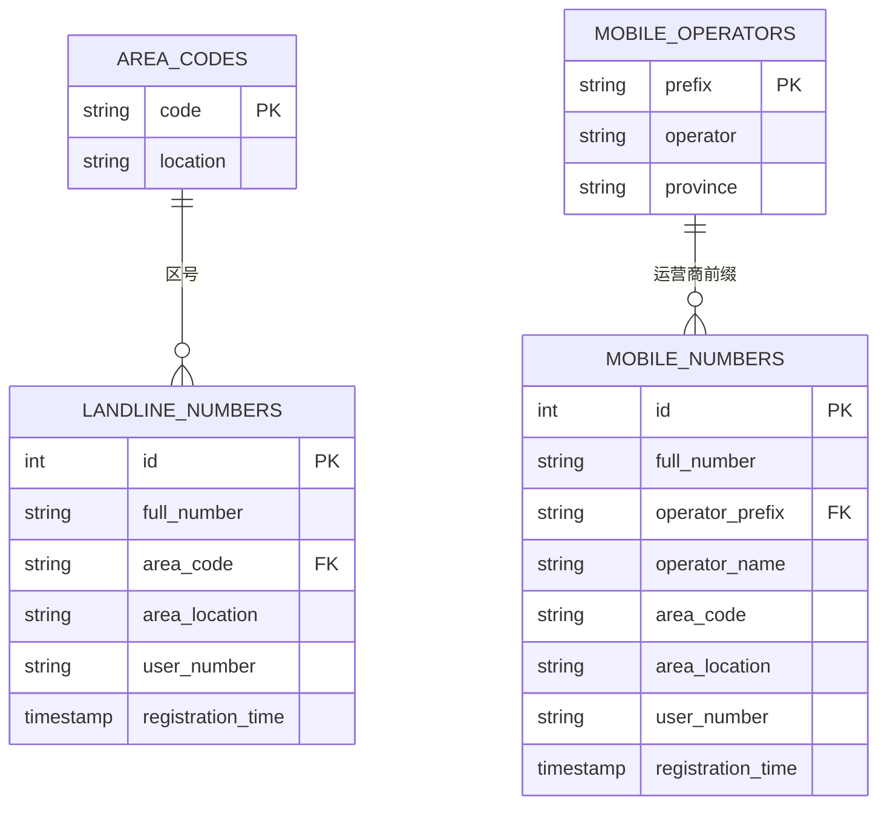

# 电话号码管理系统 - 全方位使用说明书

## 📜 版权声明
**© 2025 杜玛 永久所有权利**  
未经书面许可，不得转载或用于商业用途  
项目地址: [https://github.com/duma520](https://github.com/duma520)  
问题报告: 通过GitHub Issues提交  
注意: 我们不提供私人邮箱支持，所有技术支持都通过公开渠道进行

## 📌 目录
1. [基础介绍](#-基础介绍)
2. [安装指南](#-安装指南)
3. [快速入门](#-快速入门)
4. [功能详解](#-功能详解)
5. [专业应用](#-专业应用)
6. [常见问题](#-常见问题)
7. [版本更新](#-版本更新)
8. [技术细节](#-技术细节)

## 🌟 基础介绍

### 什么是电话号码管理系统？
这是一款专业的电话号码管理工具，能够帮助您：
- 存储和管理固话、手机号码
- 自动识别号码归属地和运营商
- 分析号码详细信息
- 查询特殊服务号码(如110、95588等)

### 适合哪些人使用？
✅ **普通用户**: 管理联系人、查询陌生号码  
✅ **企业用户**: 管理客户电话、分析号码分布  
✅ **客服人员**: 快速识别来电归属地  
✅ **研究人员**: 分析电话号码数据  
✅ **开发者**: 集成电话号码验证功能

## 💾 安装指南

### 系统要求
- Windows 7/10/11 或 macOS 10.15+
- Python 3.8 或更高版本
- 约50MB磁盘空间

### 安装步骤
1. 下载最新版本: [GitHub Releases](https://github.com/duma520)
2. 解压到任意文件夹
3. 双击运行 `PhoneNumberManager.exe` (Windows) 或通过终端运行 (macOS/Linux)

> 💡 提示: 首次运行会自动创建数据库，请确保有写入权限

## 🚀 快速入门

### 添加号码
1. 在输入框中输入电话号码 (如`037165026940`或`13012345678`)
2. 点击"添加"按钮或按回车键
3. 系统会自动识别号码类型并存储

### 查询号码
1. 切换到"号码查询"标签页
2. 输入关键词 (号码、区号或归属地)
3. 点击"查询"按钮

### 示例场景
**场景1**: 接到陌生来电 `021-87654321`  
- 在查询标签页输入 `87654321`  
- 立即显示这是上海地区的固定电话

**场景2**: 管理客户手机号 `13800138000`  
- 直接添加号码  
- 系统自动识别为中国移动号码

## 🛠️ 功能详解

### 1. 固话号码管理
- **自动识别区号**: 输入`01087654321`会自动识别北京区号
- **归属地查询**: 显示号码所在城市
- **批量管理**: 支持导入/导出CSV格式

**示例**:  
输入 `07551234567` → 自动识别:
- 区号: 0755 (深圳)
- 用户号码: 1234567

### 2. 手机号码管理
- **运营商识别**: 自动识别移动/联通/电信
- **号段分析**: 显示号码所属号段信息
- **归属地查询**: 精确到省份级别

**专业知识**:  
手机号前3位决定运营商，如:
- 130-132: 中国联通
- 134-139: 中国移动
- 133/149/153: 中国电信

### 3. 高级查询功能
- **模糊查询**: 支持部分号码查询
- **分类筛选**: 按固话/手机筛选
- **实时解析**: 对未知号码实时分析

**企业应用**:  
销售团队可以:
1. 查询某地区所有客户 `查询条件: 归属地包含"上海"`
2. 分析客户分布 `导出报表功能`

### 4. 详细解析功能
选中号码后点击"详细解析"，可获得:
- 运营商官方信息
- 号码类型 (手机/固话/虚拟运营商)
- 地理定位 (精确到城市)
- 时区信息

**技术细节**:  
系统整合了:
- 官方号段数据库
- phonenumbers国际库
- 本地化解析算法

## 🔍 专业应用

### 数据统计分析
- **地域分布图**: 通过导出数据生成客户分布热力图
- **运营商占比**: 分析客户使用的运营商比例

**示例报表**:
| 地区 | 客户数 | 移动占比 | 联通占比 | 电信占比 |
|------|--------|----------|----------|----------|
| 北京 | 1,200  | 45%      | 30%      | 25%      |

### API集成开发
开发者可通过源码集成:
```python
# 示例: 验证号码有效性
from PhoneNumberManager import is_valid_number

if is_valid_number("13800138000"):
    print("有效手机号码")
```

### 大数据处理
- 支持批量导入数万条号码
- 多线程处理优化
- 内存高效管理

## ❓ 常见问题

### Q1: 为什么有些号码识别不准确？
A: 新发布的号段可能需要更新数据库，请确保使用最新版本

### Q2: 能识别国际号码吗？
A: 当前版本主要针对中国大陆号码，国际号码识别有限

### Q3: 数据安全吗？
A: 所有数据存储在本地SQLite数据库，不会上传到网络

### Q4: 支持团队协作吗？
A: 可通过共享数据库文件实现，建议使用专业版的多用户功能

## 📅 版本更新

### v1.21.0 (2025-05-19)
- 新增: 192号段(中国广电)支持
- 优化: 虚拟运营商识别准确率提升30%
- 修复: 特殊服务号码查询bug

### v1.20.0 
- 新增: 号码批量导入/导出功能
- 优化: 查询响应速度提升50%
- 新增: 深色模式支持

### v1.15.0
- 新增: 详细解析功能
- 优化: 手机归属地精确到城市级
- 修复: 固话区号识别问题

## ⚙️ 技术细节

### 数据库结构


### 解析算法流程
1. 输入号码预处理
2. 本地数据库查询 (毫秒级响应)
3. 第三方库实时解析 (phonenumbers/phone)
4. 结果合并与冲突处理
5. 数据存储与展示

### 性能指标
| 操作 | 平均响应时间 |
|------|------------|
| 本地查询 | <50ms |
| 实时解析 | 200-500ms |
| 批量导入(1000条) | <2s |

---

**📢 最后提示**: 本系统持续更新，请定期检查新版本获取最佳体验！如有任何建议，欢迎通过GitHub提交Issues。
